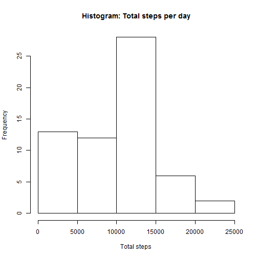
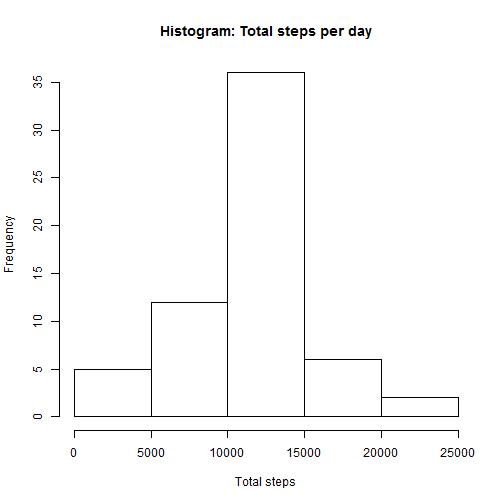
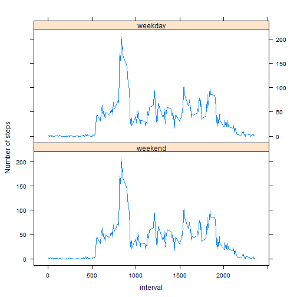

## Loading and preprocessing the data

```r
suppressWarnings(suppressMessages(library(doBy)))
activity <- read.csv("activity.csv", sep = ",", header=TRUE)
activity$date <- as.POSIXct(activity$date, format = "%Y-%m-%d")
```


## What is mean total number of steps taken per day?

1. Calculate the total number of steps taken per day


```r
total_steps <- summaryBy(steps ~ date, data=activity, FUN= sum, na.rm=TRUE)
```

2. Make a histogram of the total number of steps taken each day


```r
hist(total_steps$steps.sum, xlab = "Total steps", main = "Histogram: Total steps per day")
```



3. Calculate and report the mean and median of the total number of steps taken per day


```r
mymedian <- median(total_steps$steps.sum)
mymean <- mean(total_steps$steps.sum)
```
Median is: 10395 and Mean is: 9354.2295082.

## What is the average daily activity pattern?
1. Make a time series plot (i.e. type = "l") of the 5-minute interval (x-axis) and the average number of steps taken, averaged across all days (y-axis)


```r
interval_avgsteps <- summaryBy(steps ~ interval , data = activity, FUN = mean, na.rm = TRUE)
plot(interval_avgsteps$interval, interval_avgsteps$steps.mean, type = "l", xlab = "Interval", ylab = "Average Steps")
```


2. Which 5-minute interval, on average across all the days in the dataset, contains the maximum number of steps?

```r
max_val <- subset(interval_avgsteps, interval_avgsteps$steps.mean == max(interval_avgsteps$steps.mean))
```
5-minute interval, 835, on average across all the days in the dataset, contains the maximum number of steps.

## Imputing missing values
1. Calculate and report the total number of missing values in the dataset (i.e. the total number of rows with NAs)

```r
totalna <- sum(is.na(activity$steps))
```
Total number of missing values in the dataset: 2304.

2. Replacing NA with mean for 5-minute interval.

3. Create a new dataset that is equal to the original dataset but with the missing data filled in.


```r
newactivity <- merge(activity,interval_avgsteps,by.x="interval", by.y="interval", all=TRUE)
newactivity$steps[is.na(newactivity$steps)] <- newactivity$steps.mean[is.na(newactivity$steps)]
```

4. Make a histogram of the total number of steps taken each day


```r
total_steps_2 <- summaryBy(steps ~ date, data=newactivity, FUN=sum)
hist(total_steps_2$steps.sum, xlab = "Total steps", main = "Histogram: Total steps per day")
```



5. Calculate and report the mean and median total number of steps taken per day.


```r
newmean <- mean(total_steps_2$steps.sum)
newmedian <- median(total_steps_2$steps.sum)
```
New mean value is 1.0766189 &times; 10<sup>4</sup> and new median value is: 1.0766189 &times; 10<sup>4</sup>.

6. Do these values differ from the estimates from the first part of the assignment?
   Yes.
   
7. What is the impact of imputing missing data on the estimates of the total daily number of steps?
   Data are more or less evenly distributed.

## Are there differences in activity patterns between weekdays and weekends?

1.Create a new factor variable in the dataset with two levels - "weekday" and "weekend" indicating whether a given date is a weekday or weekend day.


```r
library(timeDate)
newactivity$wday <- factor((isWeekday(newactivity$date,wday=1:5)), levels=c(FALSE, TRUE), labels=c('weekend', 'weekday'))
```

2.Make a panel plot containing a time series plot (i.e. type = "l") of the 5-minute interval (x-axis) and the average number of steps taken, averaged across all weekday days or weekend days (y-axis).


```r
library(lattice)
xyplot(steps.mean ~ interval | wday, data=newactivity,  type="l", layout = c(1,2), ylab = "Number of steps")
```



